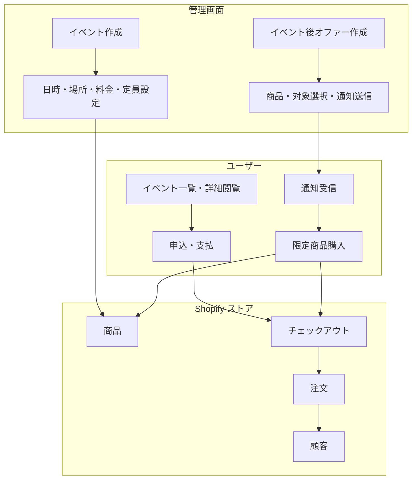
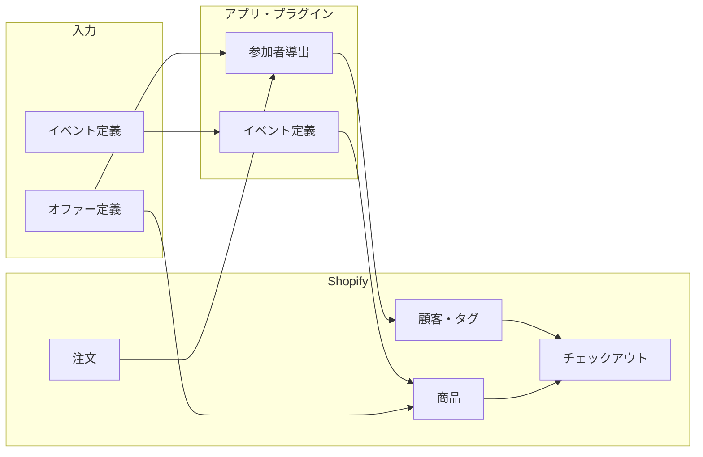
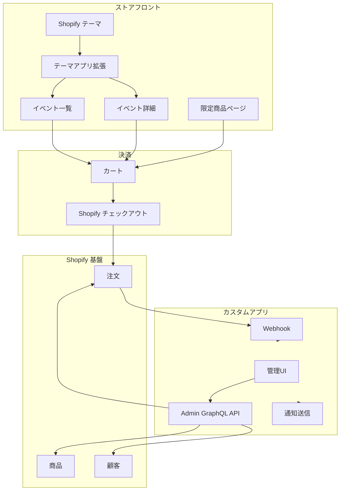
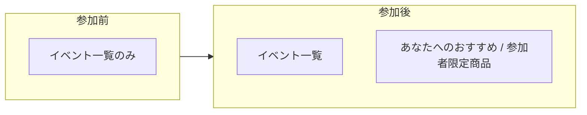

# システム構成（アーキテクチャ）

## 概要

Shopify を基盤に、**イベントの作成・申込・支払**と**イベント後の参加者限定商品オファー・購入**を扱う構成です。

**推奨方針**: ユーザーに「2つのサイト」と感じさせないため、**ストアフロントは一つの統一ストア**（テーマアプリ拡張でイベント一覧と「あなた向け商品」を同一レイアウトで表示。代替としてカスタムセクションも可）とし、**イベント作成は GM Event Ticketing**（サブスク不要）＋ **参加者限定表示・オファー管理はカスタム開発** ＋ **通知はプラグイン**（メール/SMS アプリ）とする構成を推奨します。

---

## 1. 全体構成図

- **管理**: イベント作成 → ストアにチケット商品が紐づく。イベント後はオファー（商品・対象・通知）を設定。
- **ユーザー**: イベント閲覧 → 申込・支払（同一チェックアウト）→ 後日通知 → 限定商品購入（同一チェックアウト）。

---

## 2. データの流れ（全体）

- **イベント定義**: GM Event Ticketing が管理（metafields 等）。チケット商品は Shopify と連携。
- **参加者**: 注文（Orders）から導出。アプリ・プラグインが参加者を識別し、顧客にタグを付与。**顧客タグは Shopify の Customer に保存**され、カスタムアプリで限定表示・通知対象の制御に利用。（※Locksmith 等のプラグインでも同機能を実現可能）
- **オファー**: 「どの商品を」「誰に」を定義し、同一チェックアウトで購入可能にする。

---

## 3. コンポーネント関係（推奨: 統一ストアフロント ＋ プラグイン中心の管理）

- ストアフロント: テーマ + テーマアプリ拡張（推奨。代替: カスタムセクション）でイベント一覧・詳細・「あなた向け商品」を同一レイアウトで表示。申込・購入は同一チェックアウト。イベントデータは GM Event Ticketing から、参加者限定表示はカスタム開発。
- 管理: GM Event Ticketing でイベント作成。カスタムアプリで参加者タグ・オファー作成・通知を一括。メール/SMS 配信は Klaviyo 等のプラグインを利用可能。
- **Admin GraphQL API**: Shopify が提供する公式 API。管理画面やカスタムアプリから、商品・顧客・注文などのストアデータを安全に読み書きするための窓口です。

---

## 4. ストアフロントの見え方（参加前・参加後）

同じストアフロントで、**参加前**と**参加後**で表示が変わります（レイアウトは同じで、条件付きブロックが増えるイメージ）。

| 状態 | ユーザーが見るもの |
|------|---------------------|
| **参加前** | イベント一覧（と詳細・申込）のみ |
| **参加後** | イベント一覧 ＋ そのユーザー向けに提案／限定表示される商品（あなたへのおすすめ・参加者限定） |

- ストアそのものは別ではなく、**参加後**のユーザーには「イベント一覧」に加えて「あなた向け商品」のブロックが表示される想定です。

---

## 5. 図の一覧（他ドキュメント）

| ドキュメント | 内容 |
|--------------|------|
| [02-tech-details.md](02-tech-details.md) | 技術スタック図・プラグイン・カスタム開発 |
| [03-diagrams.md](03-diagrams.md) | ストアフロント表示の違い・管理／ユーザーフロー・画面遷移・参加者と限定商品の関係図 |
| [04-next-steps.md](04-next-steps.md) | 次のステップ・ロードマップ |
