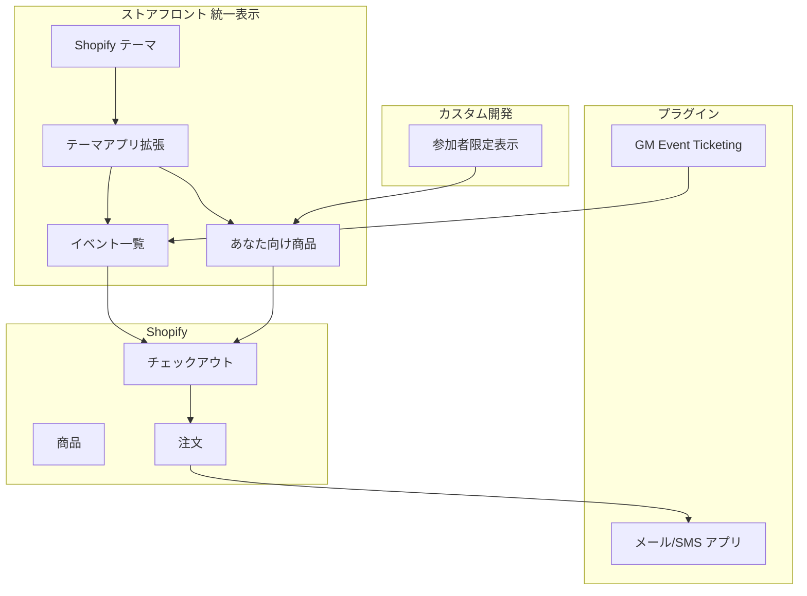

# 技術詳細

## 推奨方針

ユーザーに「2つのサイト」と感じさせないため、**ストアフロントは一つの統一ストア**とし、**イベント作成はプラグイン**（GM Event Ticketing）＋ **参加者限定表示・オファー管理はカスタム開発**とする構成を推奨します。

| レイヤー | 推奨 | 理由 |
|----------|------|------|
| **ストアフロント** | 同一テーマ内で**テーマアプリ拡張**を開発（代替: カスタムセクション） | イベント一覧と「あなた向け商品」を**一つの画面・ナビ**で表示し、一つのサイトとして体験させるため。イベントデータは GM Event Ticketing から、参加者限定表示はカスタム開発で実装。 |
| **管理** | **GM Event Ticketing**（イベント作成）＋ **カスタムアプリ**（参加者タグ・オファー・通知）＋ **メール/SMS アプリ** | イベント作成は GM Event Ticketing（サブスク不要、チケット 1 枚あたり約 $1）。参加者タグ・オファー・通知はカスタムアプリで実装。 |
| **参加者タグ** | カスタムアプリ（Webhook で注文受信 → タグ付与） | 申込完了時に顧客へタグ付与し、参加者限定表示・配信アプリのセグメントで利用。 |

開発量の目安: **中程度**（ストアフロント統一表示 ＋ 参加者限定表示 ＋ オファー・通知用のカスタムアプリ）。イベント作成は GM Event Ticketing で対応し、サブスクリプション不要で運用できます。

---

## 1. 技術スタック図（推奨構成）

- **ストアフロント**: テーマ ＋ テーマアプリ拡張（推奨。代替としてカスタムセクションも可）でイベント一覧・あなた向け商品を同一レイアウトで表示。イベントデータは GM Event Ticketing から、参加者限定表示はカスタム開発で実装。
- **管理**: GM Event Ticketing でイベント作成。カスタムアプリで参加者タグ・オファー作成・通知を一括。メール/SMS 配信は Klaviyo 等のプラグインを利用可能。

---

## 2. 技術スタック一覧（推奨構成）

| レイヤー | 技術・役割 |
|----------|------------|
| **ストアフロント** | テーマ ＋ テーマアプリ拡張（推奨。代替: カスタムセクション）。イベント一覧・「あなた向け商品」を同一レイアウトで表示。イベントは GM Event Ticketing、参加者限定表示はカスタム開発。 |
| **管理** | GM Event Ticketing でイベント作成。カスタムアプリで参加者タグ・オファー作成・通知を一括。メール/SMS 配信は Klaviyo 等のプラグインを利用可能。 |
| **参加者タグ** | カスタムアプリ（Webhook で注文受信 → 顧客にタグ付与）。 |
| **決済** | Shopify チェックアウト（イベント申込・限定商品とも同一）。 |

---

## 3. 推奨構成・参照プラグイン

| 用途 | 推奨 | 理由 |
|------|------|------|
| **イベント・チケット** | **GM Event Ticketing** | サブスクリプション不要（チケット 1 枚あたり約 $1 の従量課金）。イベント作成・チケット販売・スキャン・PDF/Apple Wallet チケットに対応。Built for Shopify。 |
| **参加者限定表示** | **カスタム開発** | 顧客タグ（Shopify 標準）で参加者を識別し、テーマアプリ拡張内で「参加者のみ表示」を実装。※Locksmith 等を参照可能。 |
| **通知** | Klaviyo / SMSBump 等 | 顧客タグでセグメントを作成し、メール・SMS を配信。プラグイン利用を推奨。 |

ストアフロントの日本語・日英切替は、Shopify の多言語（Translate & Adapt）とテーマで対応します。

---

## 4. カスタム開発に必要な技術と配置

推奨構成で開発する**カスタム部分**に必要な技術と、それらが**どこに配置・稼働するか**をまとめます。

### 4.1 ストアフロントの統一表示（カスタム部分）

**必要な技術**

- **テーマアプリ拡張**（推奨）: Shopify CLI で作成する Theme App Extension。Liquid または JavaScript（React 可）で、イベント一覧ブロック・「あなた向け商品」ブロックを実装。イベントデータは GM Event Ticketing の metafields または Storefront API から取得。
- **参加者限定表示（カスタム）**: ログイン顧客のタグ（Shopify 標準）を参照し、参加者タグを持つ顧客にのみ「あなた向け商品」ブロックを表示。商品は参加者限定コレクションから取得し、拡張／セクション内でタグ判定を行う。※Locksmith 等を参照可能。
- **代替: カスタムテーマセクション**: テーマ内の Liquid ＋ JavaScript。GM Event Ticketing の metafields 等からイベントデータを取得。参加者限定表示のタグ判定も同様にテーマ内で実装。

**どこに存在するか**

- **テーマアプリ拡張**: 1 つの **Shopify アプリ**のリポジトリ内に `extensions/` として含める。`shopify app deploy` でデプロイすると、拡張は **Shopify の CDN** に配信され、ストアのテーマで「アプリブロック」として利用可能になる。ストアのドメイン上でレンダリングされるため、ユーザーからは「同じサイト」に見える。
- **カスタムテーマセクション**: ストアの**テーマ**（またはカスタムテーマのリポジトリ）に Liquid/JS を追加。テーマのデプロイに含まれる。アプリは不要だが、テーマの更新・バージョン管理はテーマ側で行う。

### 4.2 カスタムアプリ（参加者タグ・オファー・通知管理）

参加者タグ付与・オファー作成・通知送信を一括で行う**カスタムアプリ**です。イベント作成は GM Event Ticketing で行います。

**必要な技術**

- **ランタイム**: Node.js。Remix（[Shopify App Template Remix](https://github.com/Shopify/shopify-app-template-remix)）または Express 等。
- **Shopify 連携**: Admin API（GraphQL）で商品・顧客・注文・下書き注文を操作。`orders/paid` Webhook で注文受信し、参加者タグを付与。必要スコープ例: `read_products`, `write_products`, `read_customers`, `write_customers`, `read_orders`, `write_draft_orders`。認証は OAuth（Shopify 組み込み）。
- **データ**: 参加者・オファー設定（どのイベント・どの商品・誰に・送信済みフラグ）を SQLite や Postgres 等の DB で保持。イベント定義は GM Event Ticketing が管理。チケット商品は Shopify と連携。
- **通知**: メールは SendGrid や Resend、SMS は Twilio 等の API をアプリ backend から呼び出す。または Shopify Flow と連携し、Flow 側で送信する。

**どこに存在するか**

- **コードベース**: 開発元（貴社または受託先）のリポジトリ。1 つの Shopify アプリとして、ストアフロント用の Theme App Extension と管理用 UI を**同じアプリ**に含めることもできる。
- **バックエンドのホスティング**: Shopify アプリの backend は**自前サーバー**に置く。例: Fly.io、Heroku、Railway、Render、AWS 等。Shopify の「アプリの URL」にこの backend の URL を設定し、管理画面では**埋め込み iframe** として表示する（同一アプリ内に拡張と管理の両方を含む場合、1 つの URL で両方のルートを提供）。
- **管理画面での見え方**: ストアの **Shopify 管理画面**の「アプリ」から起動。アプリを開くと、その URL（貴社 backend）が iframe で表示され、オファー作成・対象選択・通知送信の画面が表示される。イベント一覧・作成は GM Event Ticketing の管理画面で行う。ストアのデータ（商品・顧客・注文）は Admin API 経由で取得するため、**データは Shopify 内にあり、アプリはその操作 UI** となる。

### 4.3 まとめ（カスタム部分の技術と配置）

| カスタム部分 | 必要な技術 | 配置・稼働場所 |
|----------------|------------|------------------|
| **ストアフロント統一表示 ＋ 参加者限定表示** | Theme App Extension（Liquid/JS または React）、Shopify CLI。イベントデータは GM Event Ticketing の metafields。商品は Storefront API。顧客タグで参加者判定。 | アプリの `extensions/`。デプロイ後は Shopify CDN 経由でストアのテーマにブロックとして組み込み。ストアのドメイン上で表示。 |
| **（代替）テーマのみ** | テーマ内 Liquid ＋ JS。GM Event Ticketing の metafields からイベントデータを取得。 | ストアのテーマ（またはカスタムテーマ）リポジトリ。テーマデプロイに含まれる。 |
| **カスタムアプリ（参加者タグ・オファー・通知）** | Node（Remix/Express）、Admin GraphQL、DB（参加者・オファー設定）、メール/SMS API。 | コードは貴社/受託リポジトリ。backend は Fly.io 等のクラウドにホスト。Shopify 管理画面の「アプリ」から iframe で表示。 |

---

## 5. データ・連携の整理

- **イベント → 商品**: GM Event Ticketing でイベントを定義し、チケット用商品を Shopify に作成・紐づけ。
- **注文 → 参加者**: `orders/paid` Webhook で注文を取得し、顧客にタグ（例: `event:123`, `attendee`）を付与するか、アプリ DB に参加者として保存。
- **限定商品**: 通常の Shopify 商品として作成し、カスタム開発（テーマアプリ拡張内のタグ判定）で「参加者のみ表示」。または下書き注文を生成し、`draftOrderInvoiceSend` でチェックアウトリンクをメール送信。（※Locksmith 等のプラグインでも同機能を実現可能）
- **通知**: 対象を「全員／グループ／個人」で指定し、参加者一覧または顧客タグから宛先を決定してメール/SMS または Flow で送信。

---

## 6. 関連ドキュメント

- [01-architecture.md](01-architecture.md) … システム構成・データの流れ
- [03-diagrams.md](03-diagrams.md) … フロー図・画面フロー・その他図の一覧
