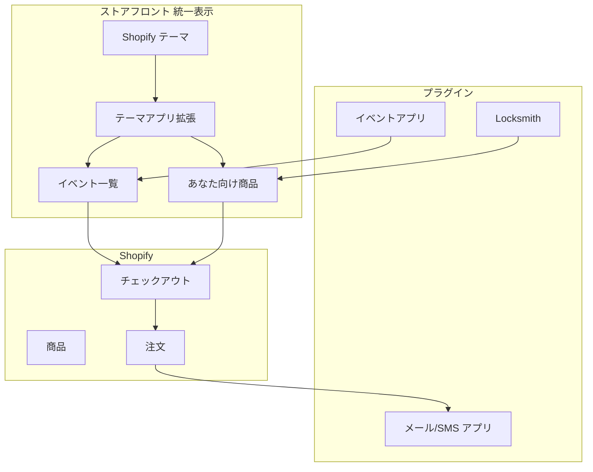

# 技術詳細

## 推奨方針（クライアント提案用・一案に統一）

ユーザーに「2つのサイト」と感じさせないため、**ストアフロントは一つの統一ストア**とし、**管理はプラグイン中心**とする構成を推奨します。複数オプションではなく、この一案として提案します。

| レイヤー | 推奨 | 理由 |
|----------|------|------|
| **ストアフロント** | 同一テーマ内で**テーマアプリ拡張またはカスタムセクション**を開発 | イベント一覧と「あなた向け商品」を**一つの画面・ナビ**で表示し、一つのサイトとして体験させるため。イベントアプリ・Locksmith のデータを同じレイアウトで表示。 |
| **管理** | **プラグイン中心**（イベントアプリ・Locksmith・メール/SMS アプリ） | イベント CRUD・参加者限定表示・通知はプラグインで充足。必要に応じ、オファー作成・通知を一画面で行う**小規模な管理専用アプリ**を追加。 |
| **参加者タグ** | イベントアプリの機能 or Flow / 小規模アプリ | 申込完了時に顧客へタグ付与し、Locksmith・配信アプリのセグメントで利用。 |

開発量の目安: **中程度**（ストアフロントの統一表示のための拡張／セクション ＋ 必要なら参加者タグ連携・オファー用の小規模管理アプリ）。フルカスタムアプリより抑えつつ、ユーザー体験は一つのサイトに統一します。

---

## 1. 技術スタック図（推奨構成）

- **ストアフロント**: テーマ ＋ テーマアプリ拡張（またはカスタムセクション）でイベント一覧・あなた向け商品を同一レイアウトで表示。データはイベントアプリ・Locksmith 等のプラグインから利用。
- **管理**: プラグイン（イベントアプリ・Locksmith・メール/SMS アプリ）。必要なら小規模な管理専用アプリでオファー作成・通知を一括。

---

## 2. 技術スタック一覧（推奨構成）

| レイヤー | 技術・役割 |
|----------|------------|
| **ストアフロント** | テーマ ＋ テーマアプリ拡張またはカスタムセクション。イベント一覧・「あなた向け商品」を同一レイアウトで表示。イベントアプリ・Locksmith のデータを利用。 |
| **管理** | イベントアプリ（例: チケット&予約管理.amp）でイベント CRUD。Locksmith で参加者限定表示。メール/SMS アプリで通知。必要なら小規模な管理専用アプリでオファー作成・通知を一括。 |
| **参加者タグ** | イベントアプリの機能、または Flow / 小規模アプリで注文完了時にタグ付与。 |
| **決済** | Shopify チェックアウト（イベント申込・限定商品とも同一）。 |

---

## 3. 推奨プラグイン（日本語対応）

管理はプラグイン中心のため、以下を推奨します。

| 用途 | 推奨プラグイン | 理由（日本語・運用） |
|------|----------------|----------------------|
| **イベント・チケット** | **チケット&予約管理.amp**（and.d） | 日本語ネイティブ。管理・ストアフロントとも日本語。日時・場所・料金・定員・Webチケット・参加者管理を一括で対応。 |
| **参加者限定表示** | **Locksmith** | 顧客タグで商品表示を制御。参加者タグを付与すれば「参加者のみ表示」が可能。Built for Shopify で安定。管理画面はストアの言語に追従。 |
| **通知** | Klaviyo / SMSBump 等 | 顧客タグでセグメントを作成し、日本語でメール・SMS を配信。 |

ストアフロントの日本語・日英切替は、Shopify の多言語（Translate & Adapt）とテーマで対応します。

---

## 4. カスタム開発に必要な技術と配置

推奨構成で開発する**カスタム部分**に必要な技術と、それらが**どこに配置・稼働するか**をまとめます。

### 4.1 ストアフロントの統一表示（カスタム部分）

**必要な技術**

- **テーマアプリ拡張**（推奨）: Shopify CLI で作成する Theme App Extension。Liquid または JavaScript（React 可）で、イベント一覧ブロック・「あなた向け商品」ブロックを実装。イベントデータはイベントアプリの metafields または Storefront API から取得。表示する商品は Locksmith の制御下なので、拡張は「テーマと同じレイアウトで同じページに表示する」役割に限定できる。
- **代替: カスタムテーマセクション**: テーマ内の Liquid ＋ JavaScript。イベントアプリが metafields や App Block を提供していれば、そのデータを参照するセクションをテーマに追加。テーマのコードベースで管理するため、アプリとして配布しない場合はこちらで完結可能。
- **共通**: 認証済み顧客の「あなた向け」表示は、Locksmith がタグで表示可否を決めるため、拡張／セクション側は「ログイン顧客向けブロックを表示するか」の判定と、商品一覧の取得（Storefront API または Liquid）があればよい。

**どこに存在するか**

- **テーマアプリ拡張**: 1 つの **Shopify アプリ**のリポジトリ内に `extensions/` として含める。`shopify app deploy` でデプロイすると、拡張は **Shopify の CDN** に配信され、ストアのテーマで「アプリブロック」として利用可能になる。ストアのドメイン上でレンダリングされるため、ユーザーからは「同じサイト」に見える。
- **カスタムテーマセクション**: ストアの**テーマ**（またはカスタムテーマのリポジトリ）に Liquid/JS を追加。テーマのデプロイに含まれる。アプリは不要だが、テーマの更新・バージョン管理はテーマ側で行う。

### 4.2 小規模な管理専用アプリ（オプション）

オファー作成・通知を一画面で行う**管理専用アプリ**を用意する場合です。

**必要な技術**

- **ランタイム**: Node.js。Remix（[Shopify App Template Remix](https://github.com/Shopify/shopify-app-template-remix)）または Express 等。
- **Shopify 連携**: Admin API（GraphQL）で商品・顧客・注文・下書き注文を操作。必要スコープ例: `read_products`, `write_products`, `read_customers`, `write_customers`, `read_orders`, `write_draft_orders`。認証は OAuth（Shopify 組み込み）。
- **データ**: オファー設定（どのイベント・どの商品・誰に・送信済みフラグ）を保持する場合は、SQLite や Postgres 等の DB。シンプルにすれば Storefront API や Admin API の結果だけを使い、永続化しない構成も可。
- **通知**: メールは SendGrid や Resend、SMS は Twilio 等の API をアプリ backend から呼び出す。または Shopify Flow と連携し、Flow 側で送信する。

**どこに存在するか**

- **コードベース**: 開発元（貴社または受託先）のリポジトリ。1 つの Shopify アプリとして、ストアフロント用の Theme App Extension と管理用 UI を**同じアプリ**に含めることもできる。
- **バックエンドのホスティング**: Shopify アプリの backend は**自前サーバー**に置く。例: Fly.io、Heroku、Railway、Render、AWS 等。Shopify の「アプリの URL」にこの backend の URL を設定し、管理画面では**埋め込み iframe** として表示する（同一アプリ内に拡張と管理の両方を含む場合、1 つの URL で両方のルートを提供）。
- **管理画面での見え方**: ストアの **Shopify 管理画面**の「アプリ」から起動。アプリを開くと、その URL（貴社 backend）が iframe で表示され、オファー作成・対象選択・通知送信の画面が表示される。ストアのデータ（商品・顧客・注文）は Admin API 経由で取得するため、**データは Shopify 内にあり、アプリはその操作 UI** となる。

### 4.3 まとめ（カスタム部分の技術と配置）

| カスタム部分 | 必要な技術 | 配置・稼働場所 |
|----------------|------------|------------------|
| **ストアフロント統一表示** | Theme App Extension（Liquid/JS または React）、Shopify CLI。イベント・商品データは metafields または Storefront API。 | アプリの `extensions/`。デプロイ後は Shopify CDN 経由でストアのテーマにブロックとして組み込み。ストアのドメイン上で表示。 |
| **（代替）テーマのみ** | テーマ内 Liquid ＋ JS。イベントアプリの metafields 等を参照。 | ストアのテーマ（またはカスタムテーマ）リポジトリ。テーマデプロイに含まれる。 |
| **管理専用アプリ（オプション）** | Node（Remix/Express）、Admin GraphQL、必要なら DB、メール/SMS API。 | コードは貴社/受託リポジトリ。backend は Fly.io 等のクラウドにホスト。Shopify 管理画面の「アプリ」から iframe で表示。 |

---

## 5. データ・連携の整理

- **イベント → 商品**: アプリでイベントを定義し、チケット用商品を Shopify に作成・紐づけ。
- **注文 → 参加者**: `orders/paid` Webhook で注文を取得し、顧客にタグ（例: `event:123`, `attendee`）を付与するか、アプリ DB に参加者として保存。
- **限定商品**: 通常の Shopify 商品として作成し、カタログ表示制御（Locksmith 等またはテーマのタグ判定）で「参加者のみ表示」。または下書き注文を生成し、`draftOrderInvoiceSend` でチェックアウトリンクをメール送信。
- **通知**: 対象を「全員／グループ／個人」で指定し、参加者一覧または顧客タグから宛先を決定してメール/SMS または Flow で送信。

---

## 6. 関連ドキュメント

- [01-architecture.md](01-architecture.md) … システム構成・データの流れ
- [03-diagrams.md](03-diagrams.md) … フロー図・画面フロー・その他図の一覧
