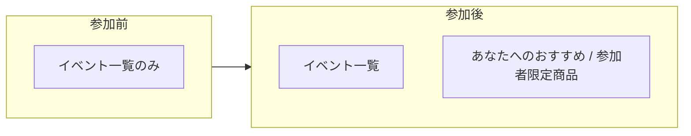
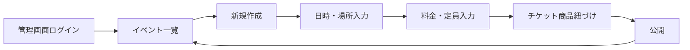
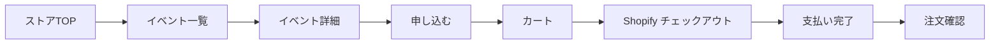
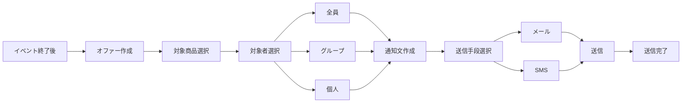
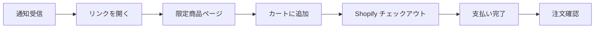
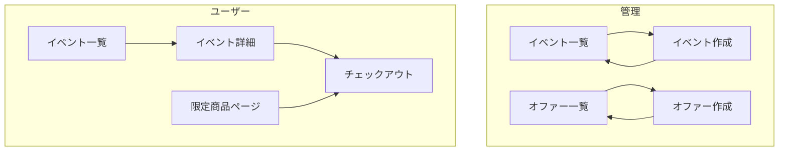
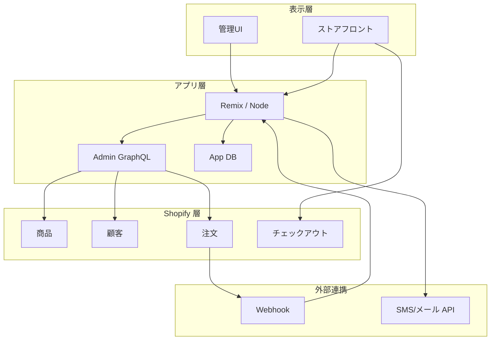
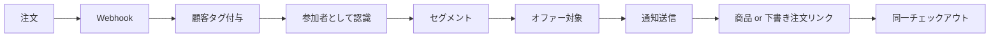

# フロー図・設計図一覧

設計を理解しやすくするためのフロー図・技術スタック図・画面遷移をまとめています。いずれも Mermaid で記載しています。

---

## 1. ストアフロント表示の違い（参加前・参加後）

同じストアフロントで、参加しているかどうかで表示が変わります。**参加前**はイベント一覧のみ、**参加後**はイベント一覧に加えて「あなたへのおすすめ／参加者限定商品」が表示されます（完全に別ストアではなく、条件付きブロックの追加）。

| 状態 | ユーザーが見るもの |
|------|---------------------|
| 参加前 | イベント一覧（と詳細・申込）のみ |
| 参加後 | イベント一覧 ＋ そのユーザー向けに提案／限定表示される商品 |

---

## 2. 管理フロー：イベント作成

| ステップ | 説明 |
|----------|------|
| 管理画面ログイン | Shopify 管理 + カスタムアプリ管理画面 |
| イベント一覧 | 既存イベントの一覧・編集・削除 |
| 新規作成 | イベント作成フォームを開く |
| 日時・場所入力 | 開催日時・会場・住所など |
| 料金・定員入力 | 価格・最大参加人数（定員） |
| チケット商品紐づけ | Shopify の商品（チケット）と紐づけ |
| 公開 | ストアフロントのイベント一覧に表示 |

---

## 3. ユーザーフロー：イベント申込・支払い

| ステップ | 説明 |
|----------|------|
| イベント一覧 | 開催日・場所・料金が一覧で見える |
| イベント詳細 | 日時・場所・料金・定員・申込ボタン |
| 申し込む | チケット商品がカートに追加される |
| チェックアウト | イベント申込も通常購入も同一チェックアウト |
| 支払い完了 | 注文確定。参加者として記録・タグ付与の対象になる |

---

## 4. 管理フロー：イベント後オファー・通知

| ステップ | 説明 |
|----------|------|
| オファー作成 | イベント後、参加者向けに限定商品を提供する設定 |
| 対象商品選択 | 非公開のまま参加者にだけ見せる商品を指定 |
| 対象者選択 | 全参加者／特定グループ（タグ・イベント別）／個人 |
| 通知文作成 | メールまたは SMS の文面（日本語想定） |
| 送信 | メール API・SMS API または Flow で送信 |

---

## 5. ユーザーフロー：限定商品の購入

| ステップ | 説明 |
|----------|------|
| 通知受信 | メールまたは SMS で限定オファーの案内を受け取る |
| リンクを開く | 商品ページまたは下書き注文のチェックアウトリンク |
| 限定商品ページ | 参加者のみ表示されるページ（他ユーザーには非公開） |
| チェックアウト | イベント申込と同じ Shopify チェックアウトで支払い |

---

## 6. 画面遷移（全体）

- **管理**: イベント一覧 ⇄ イベント作成、オファー一覧 ⇄ オファー作成。
- **ユーザー**: イベント一覧 → 詳細 → チェックアウト。限定商品ページ → チェックアウト（同一基盤）。

---

## 7. 技術スタック（レイヤー図）

---

## 8. 参加者と限定商品の関係

- 注文完了 → Webhook でアプリが受信 → 顧客にタグ付与 → 参加者・セグメントとして保持。
- オファー作成時に「全員／グループ／個人」を指定し、通知でリンクを送付。購入は同一チェックアウトで完結。

---

## 9. 関連ドキュメント

- [01-architecture.md](01-architecture.md) … システム構成・データの流れ
- [02-tech-details.md](02-tech-details.md) … 技術スタック・プラグイン推奨
