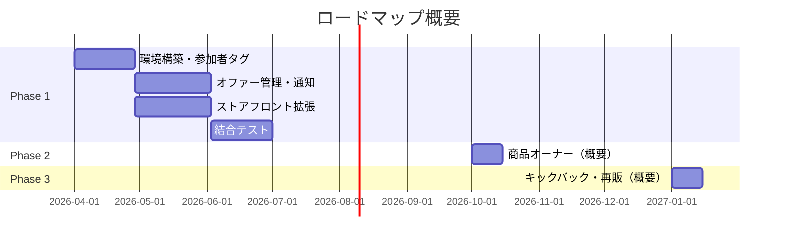

# 次のステップ・ロードマップ

## 概要

本ドキュメントは、プロジェクトの実行計画とロードマップを示します。**Phase 1** は初期リリースとして詳細化し、**Phase 2・3** は将来の拡張としてハイレベルに記載します。Phase 1 の設計は Phase 2・3 の追加を妨げないよう、スケーラブルに進めます。

---

## Phase 1: 初期リリース

イベント申込・参加者限定オファー・購入の基本機能を実装します。

### 1.1 タスク一覧・スケジュール・LOE

| # | タスク | LOE | スケジュール目安 | 備考 |
|---|--------|-----|------------------|------|
| 1.1 | **環境構築**（Shopify アプリ、GM Event Ticketing 導入、DB・ホスティング） | 1–2 週 | 開始時 | 詳細計画が必要 |
| 1.2 | **参加者タグ付与**（Webhook 受信、顧客タグ付与ロジック） | 1 週 | 1.1 完了後 | |
| 1.3 | **オファー管理 UI**（管理画面：オファー作成・対象選択・通知送信） | 2–3 週 | 1.2 と並行可 | 詳細計画が必要 |
| 1.4 | **テーマアプリ拡張**（イベント一覧ブロック、あなた向け商品ブロック） | 2–3 週 | 1.1 完了後 | GM Event Ticketing 連携仕様の確定が必要 |
| 1.5 | **参加者限定表示**（タグ判定、限定商品の表示制御） | 1–2 週 | 1.4 に含む or 続行 | |
| 1.6 | **通知送信**（メール/SMS API 連携 or Klaviyo 連携） | 1–2 週 | 1.3 に含む | 通知手段の選定が必要 |
| 1.7 | **結合テスト・調整** | 1–2 週 | 全タスク完了後 | |

**Phase 1 全体 LOE**: 約 **8–14 週**（1 名想定。並行作業で短縮可能）

---

### 1.2 詳細計画がまだ必要な項目

| 項目 | 内容 | 決定が必要なこと |
|------|------|------------------|
| **GM Event Ticketing 連携** | イベントデータの取得方法 | metafields の構造、Storefront API での取得可否、イベント ID の紐づけ方 |
| **参加者タグ設計** | タグの命名規則・粒度 | 例: `event:{id}`, `attendee`, イベント別タグの有無 |
| **オファー対象の指定** | 誰にオファーを送るか | 全員／イベント別／タグ別の UI とロジック |
| **通知手段** | メール・SMS の実装方法 | 自前 API（SendGrid/Twilio）vs Klaviyo 等のプラグイン、コスト比較 |
| **商品とオファーの紐づけ** | オファー対象商品の管理 | 商品の metafields、コレクション、またはアプリ DB での管理 |
| **ストアテーマ** | 拡張の組み込み先 | 使用テーマ、アプリブロックの配置場所 |

---

### 1.3 スケーラビリティ（Phase 2・3 を見据えた設計）

Phase 1 の実装時、以下の点を考慮し、将来の拡張を妨げない設計にします。

| 設計上の考慮 | 理由 |
|--------------|------|
| **商品に metafields または拡張可能な属性を用意** | Phase 2 で「オーナー」情報を付与する余地を残す |
| **参加者・顧客の紐づけを明確に** | 参加者と商品オーナーの関係を Phase 2 で追加しやすい |
| **オファー設定のデータモデルを拡張可能に** | Phase 3 のキックバック・再販ルールを後から追加できる |
| **決済フローは Shopify 標準を維持** | Phase 3 のオーナー向け決済・分配を既存フローに乗せやすい |

---

## Phase 2: 商品オーナー（ハイレベル）

参加者のうち、商品の**オーナー**となる者を設け、商品ページにオーナー情報を表示します。

### 概要

- イベント参加者の一部が、限定商品の「オーナー」として登録可能
- 商品ページにオーナー情報（名前・紹介など）を表示
- オーナーと商品の紐づけは管理画面またはオファー作成時に設定

### スケジュール・LOE（目安）

| 項目 | 目安 |
|------|------|
| LOE | 2–4 週（詳細設計後に確定） |
| 前提 | Phase 1 完了、オーナー概念の業務要件確定 |

### 詳細計画

Phase 2 着手前に、オーナーの定義・登録フロー・表示内容などを詳細に設計します。

---

## Phase 3: オーナーキックバック・再販（ハイレベル）

オーナーへの売上分配（キックバック）や、オーナーによる仕入れ・再販を検討します。

### 概要

- **キックバック**: 商品が売れた際、オーナーに一定割合を分配する仕組み
- **再販**: オーナーが商品を仕入れて、自身のチャネルで再販するオプション

### スケジュール・LOE（目安）

| 項目 | 目安 |
|------|------|
| LOE | 4–8 週以上（決済・分配ロジックにより変動） |
| 前提 | Phase 2 完了、ビジネスルール・法務の検討 |

### 詳細計画

Phase 3 着手前に、分配率・決済フロー・再販条件・法務面を詳細に設計します。

---

## ロードマップ図（概要）

※ Phase 1 の結合テストは 7/1 頃完了を目安。実際のスケジュールは進捗に応じて調整します。

---

## 関連ドキュメント

| ドキュメント | 内容 |
|--------------|------|
| [01-architecture.md](01-architecture.md) | システム構成・データの流れ |
| [02-tech-details.md](02-tech-details.md) | 技術スタック・プラグイン・カスタム開発 |
| [03-diagrams.md](03-diagrams.md) | フロー図・画面遷移 |
